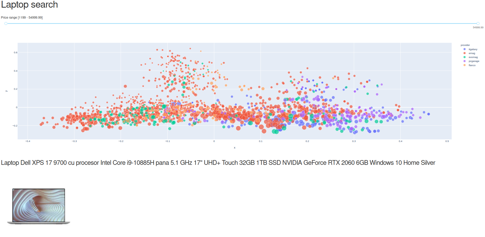

# laptopsearch

I've created this dashboard to allow quick exploration of the laptop market on major e-commerce websites from Romania.

http://laptopsearchro.herokuapp.com/




It helps you see at a glance what are the main options, understand the price ranges and compare between different providers. 

Each point in the chart represents a laptop page on the main ecommerce websites. Currently data is scraped from emag, evomag, flanco, itgalaxy, mediagalaxy and pcgarage.

In order to arrange the points in space I've used tf-idf algorithm to extract features from product titles. Next the features are feed into a PCA model to reduce the representations in two dimensions. 

Data is next ploted using the scatter from plotly. Each provider is represented with an unique colour and size of the points are scaled according to the price.

A price range filter is provided for narrowing down the options. Cliking on a specific point will display a picture and title of the product.


## Data scraper

The data is scraped using the browser extension https://webscraper.io/ 


## Deployment on heroku


1. Build container

```
heroku container:push web -a laptopsearchro
```

2. Release

```
heroku container:release web -a laptopsearchro
```

3. Check logs 

```
heroku logs --tail -a laptopsearchro
```